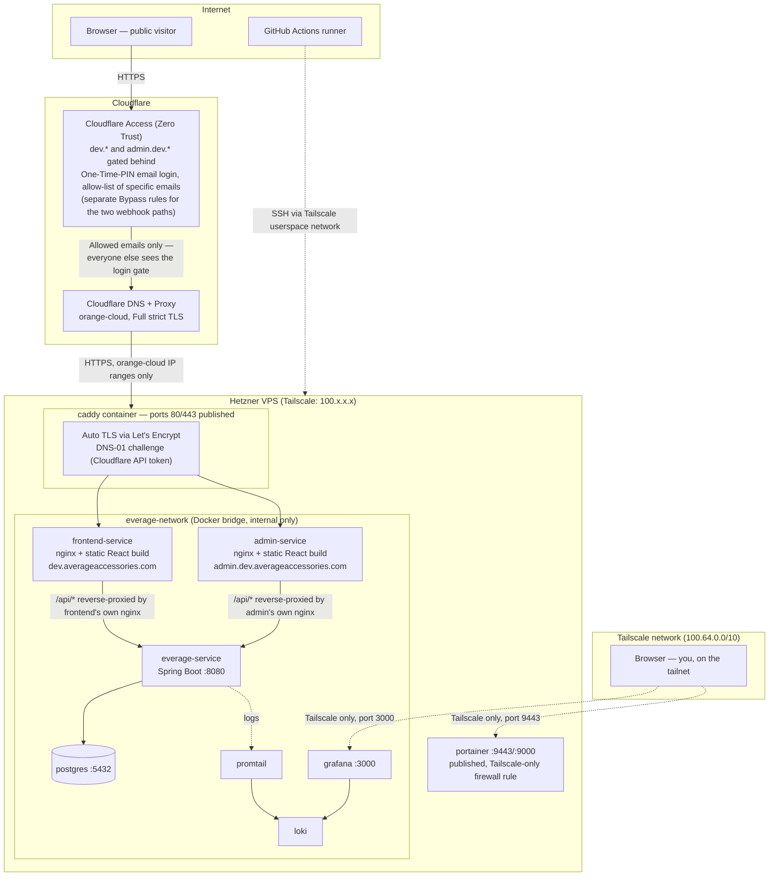
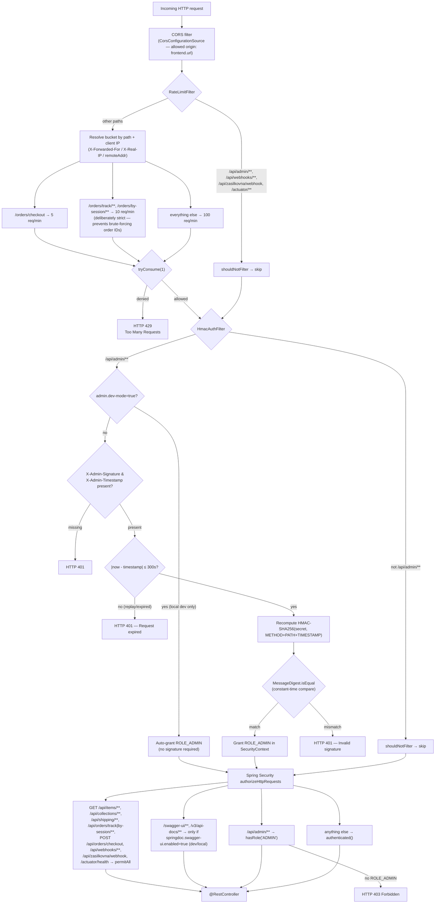

# Everage — Architecture Overview

This document describes the infrastructure layout, request routing, and the
backend middleware/filter chain, so it's clear how a request travels from the
internet all the way to a controller method (and back).

## 1. Infrastructure (dev environment)

Single VPS (Hetzner), one Docker network (`everage-network`). Caddy is the
only container with ports published to the internet — every other service is
only reachable from inside the Docker network (`expose`, not `ports`).

Key points:

- **Both `dev.averageaccessories.com` and `admin.dev.averageaccessories.com`
  are gated by Cloudflare Access** (Zero Trust), each configured as a
  Self-hosted application with an Allow policy listing specific emails.
  Visitors enter their email, get a one-time PIN, and only then reach
  Caddy/the app — anyone not on the list sees Cloudflare's login gate and
  never reaches the origin. Two paths are deliberately excluded via separate
  **Bypass** applications, since external services can't complete an email
  login: `/api/webhooks/stripe` and `/api/zasilkovna/webhook`. Both remain
  protected by their own signature/token verification at the application
  layer (see below), so bypassing Cloudflare Access here does not weaken
  security — it just lets Stripe/Zásilkovna reach the endpoint that will
  authenticate the payload itself.
- **Admin panel has two independent layers of access control.** Cloudflare
  Access blocks anyone whose email isn't on the allow-list before the
  request ever reaches the VPS. Anyone who does get through (an allow-listed
  but otherwise unauthorized visitor, or a compromised Cloudflare Access
  session) still needs the `ADMIN_SECRET` HMAC signature to call any
  `/api/admin/**` endpoint — see `HmacAuthFilter` below. Neither layer alone
  is trusted as sufficient; this is intentional defense in depth.
- **Same-origin API calls.** Both browsers only ever talk to their own
  hostname (`dev.averageaccessories.com` or
  `admin.dev.averageaccessories.com`). Each nginx proxies its own `/api/*`
  requests to `everage-service:8080` *inside* the Docker network. This
  avoids CORS entirely for the primary flows and keeps the CSP
  `connect-src` minimal.
- **Caddy is the only public ingress**, and it only ever sees traffic that
  Cloudflare Access has already let through (for the two gated hostnames) or
  webhook traffic on the two explicitly bypassed paths.
- **CI/CD reaches the VPS over Tailscale**, not the public internet. SSH
  (port 22) on the Hetzner firewall is restricted to the Tailscale CGNAT
  range (`100.64.0.0/10`). The GitHub Actions runner joins the tailnet
  on-demand via `tailscale/github-action` (OAuth client), then
  `appleboy/ssh-action` connects to the server's Tailscale IP.
- **Grafana / Portainer** are intentionally *not* routed through Caddy or
  given a public domain at all — internal ops tooling, reachable only over
  Tailscale, restricted at the Hetzner firewall level. Unlike the admin
  panel, there's no "invite specific external people" use case for these,
  so Tailscale's all-or-nothing tailnet access is the right fit here.

## 2. Backend request pipeline (Spring Security filter chain)

Every HTTP request to `everage-service` passes through the same filter chain
before it reaches a `@RestController`. Two custom filters were added ahead of
Spring Security's own authentication filter:

### RateLimitFilter (`config/security/RateLimitFilter.java`)

- Runs first, before authentication — cheap to reject abusive traffic early.
- Per-IP, per-endpoint-category token buckets (Bucket4j), kept in an
  in-memory `ConcurrentHashMap` (fine for a single-instance deployment; would
  need a shared store like Redis if the backend is ever scaled horizontally).
- Three tiers: `checkout` (5/min), `order-tracking` (10/min — order numbers
  and session IDs are secrets known only to the buyer, so this limit exists
  specifically to make brute-forcing them impractical), `general` (100/min).
- Skips `/api/admin/**` (already protected by HMAC), webhooks (trusted
  external sources with their own signature verification), and
  `/actuator/**`.

### HmacAuthFilter (`config/security/HmacAuthFilter.java`)

- Only active for `/api/admin/**` — everything else short-circuits via
  `shouldNotFilter`.
- No sessions, no passwords. The admin panel signs each request with
  `HMAC-SHA256(secret, METHOD + PATH + TIMESTAMP)` using a shared secret
  (`ADMIN_SECRET`, generated with `openssl rand -hex 32`, never committed).
- Timestamp must be within 300 seconds of server time — bounds replay-attack
  windows without requiring nonce storage.
- Signature comparison uses `MessageDigest.isEqual` (constant-time) to avoid
  timing side-channels.
- `admin.dev-mode=true` (local/dev only, never set in prod `.env`) bypasses
  the signature check entirely and auto-grants `ROLE_ADMIN` — convenient for
  local development against a real backend without wiring up signing.

### Authorization rules (`SecurityConfig.java`)

Declarative allow-list, evaluated in order:

- Public read endpoints for the storefront: item/collection browsing,
  shipping options/countries, package tracking.
- Order lookup by session ID or order number is intentionally `permitAll` —
  the "auth" here is *knowing the identifier*, which is why `RateLimitFilter`
  applies its strictest tier to these two paths (see above).
- `POST /api/orders/checkout` is public (anyone can start a checkout) but
  rate-limited.
- Webhooks (`/api/webhooks/**`, `/api/zasilkovna/webhook`) are public at the
  Spring Security layer because they authenticate via their own
  provider-specific signature (Stripe signs with `Stripe-Signature`;
  Zásilkovna via a webhook token) rather than session/HMAC auth.
- `/swagger-ui/**` and `/v3/api-docs/**` are gated behind
  `springdoc.swagger-ui.enabled` — off in production.
- `/api/admin/**` requires `ROLE_ADMIN`, which only `HmacAuthFilter` can
  grant.
- Everything else defaults to `authenticated()` — a deliberate fail-closed
  default for any endpoint added later without an explicit rule.

CORS is configured with a single allowed origin (`frontend.url`, i.e. the
customer-facing storefront) — the admin panel doesn't need a CORS entry
because it talks to the backend same-origin through its own nginx proxy, not
directly cross-origin.

## 3. Environment configuration

Backend behavior is entirely driven by environment variables injected via
`docker-compose.yml` (see `docker/docker-compose.yml` and `.env.example`).
Notable ones referenced above:

| Variable | Used by | Purpose |
|---|---|---|
| `ADMIN_SECRET` | `HmacAuthFilter` | Shared HMAC signing secret for admin auth |
| `ADMIN_DEV_MODE` | `HmacAuthFilter` | Bypasses HMAC check (dev/local only) |
| `FRONTEND_URL` | `SecurityConfig` (CORS), `StripeCheckoutService` (Stripe success/cancel redirect URLs) | Customer-facing origin |
| `CF_API_TOKEN` | Caddy (`Caddyfile`) | Cloudflare DNS-01 token for automatic TLS |
| `DATABASE_URL` / `_USERNAME` / `_PASSWORD` | Spring datasource | Postgres connection |
| `STRIPE_API_KEY` / `STRIPE_WEBHOOK_SECRET` | Stripe integration | Payment processing + webhook signature verification |

## 4. Related docs

- `docker/docker-compose.yml` — full service definitions, volumes, networks
- `docker/Caddyfile` — routing + TLS config
- `.env.example` — full list of required environment variables
